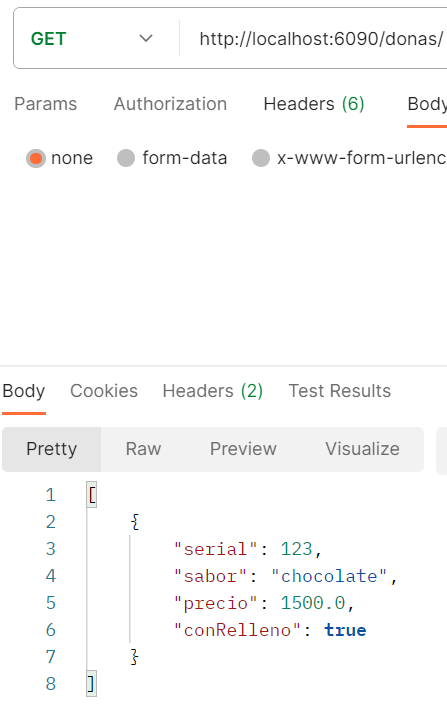

## Contexto de la aplicacion
Esta es una aplicacion para una tienda que vende postres. Hay 3 tipos de postres: galletas, donas y tortas. 
Se puede actualizar el catalogo de donas , tortas y galletas. 

Los pedidos que hacen los clientes tienen los siguientes datos:
- serial: identificador del pedido
- nombre: nombre de la persona que hizo la compra
- fecha: fecha de la compra
- precioConDescuento: precio total del pedido

Las galletas a su vez tienen las siguientes caracteristicas:
- id: identificador de la galleta
- sabor
- tamaño
- tieneGluten: si tiene gluten o no
- precio

Ademas, se tienen 2 interfaces que se pueden aplicar a todos los postres
IDescuento y ISabores las cuales sirven para aplicar un descuento al precio del postre y para adicionar un segundo sabor. 

Ejemplo de la opracion get Donas

